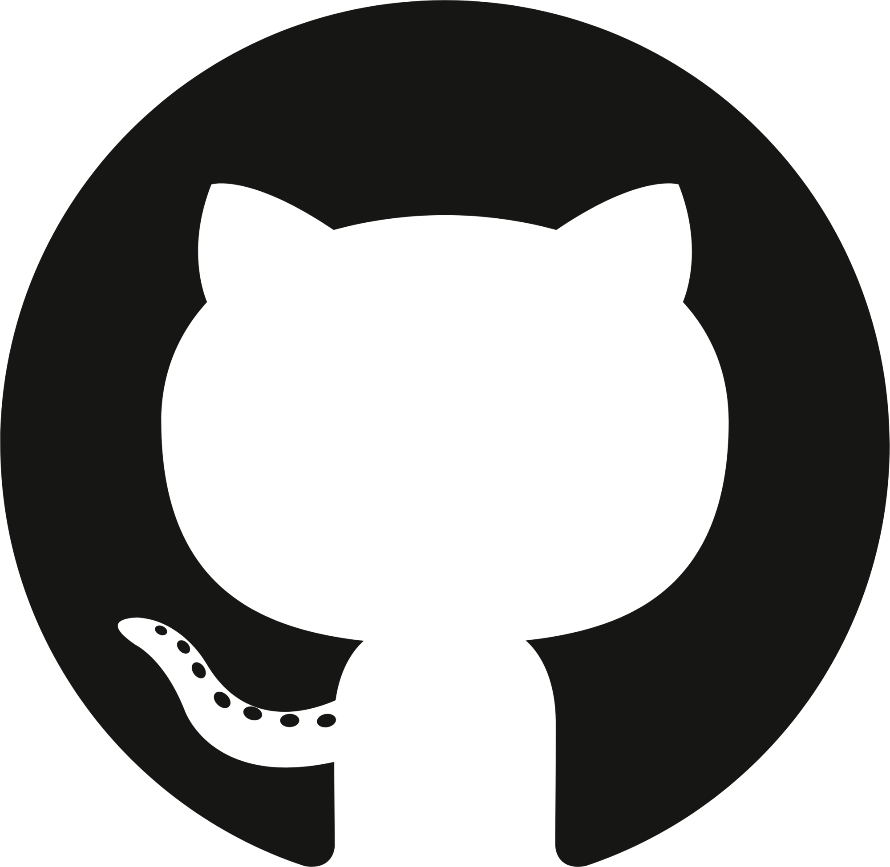
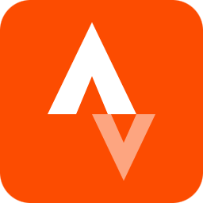

### Hi there 👋

I am a software engineer at [ETAS GmbH](https://www.etas.com). I graduated with a major and minor degree in Mechanical Engineering and Applied Mathematics, from [Indian Institute of Technology,Kanpur](https://www.iitk.ac.in) in 2017 and further with a master's degree in Automotive Engineering from [RWTH Aachen](http://www.rwth-aachen.de/cms/~a/root/?lidx=1) in 2021. Currently, I am working on productising the ETAS middleware solution. I had worked on [SET Level](https://setlevel.de/) dealing with the simulation and modelling for Level 4 and 5 automated driving system. Previously, I worked on Sensor fusion for Navigation and path planning of an Unmanned Aerial Vehicle with [Galileo group](http://www.irt.rwth-aachen.de/cms/IRT/Forschung/~izql/Galileo/?lidx=1) at [Institute of Automatic Control](http://www.irt.rwth-aachen.de/cms/~iung/IRT/lidx/1/), [RWTH Aachen](http://www.rwth-aachen.de/cms/~a/root/?lidx=1). I have also worked on the design and dynamics of Automotive vehicles at [IITK Motosports](https://www.iitk.ac.in/ame/sae/), Humanoid Robots at [Italian Institute of Technology, Genova](https://www.iit.it) and material handling robots for warehouse at [Grey Orange Robotics](www.greyorange.com). To know more about me, you can see my detailed Curriculum Vitae [here](https://vibhoraggarwal.github.io/files/CV.pdf) or short resume [here](https://vibhoraggarwal.github.io/files/VibhorResume_en.pdf)

When I am not working I am reading or hearing books, learning languages on [Duolingo](https://www.duolingo.com/profile/vibhorag), running, cycling outdoors (see my [profile on Strava](https://www.strava.com/athletes/21880684) )or simply meeting my friends.

<!-- https://github.com/anuraghazra/github-readme-stats -->

  

  

Follow me on social media:

  
  
  
  

To know more about me: [>>click here](https://vibhoraggarwal.github.io/)
<!--
**vibhoraggarwal/vibhoraggarwal** is a ✨ _special_ ✨ repository because its `README.md` (this file) appears on your GitHub profile.

Here are some ideas to get you started:

- 🔭 I’m currently working on ...
- 🌱 I’m currently learning ...
- 👯 I’m looking to collaborate on ...
- 🤔 I’m looking for help with ...
- 💬 Ask me about ...
- 📫 How to reach me: ...
- 😄 Pronouns: ...
- ⚡ Fun fact: ...
-->
